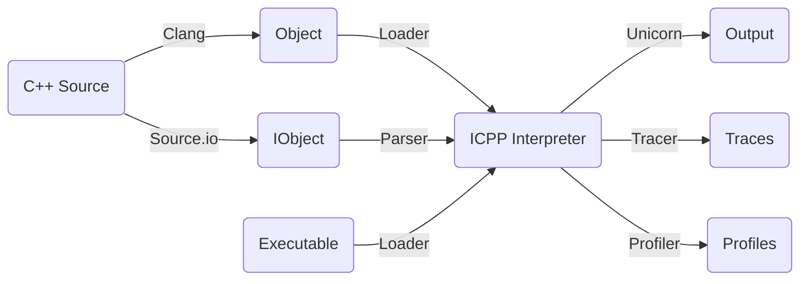
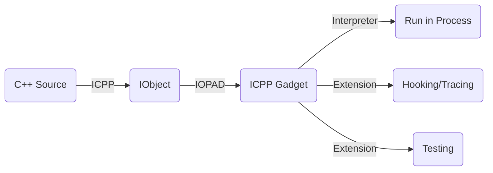

# ICPP - Running C++ in anywhere like a script
**Interpreting C++, executing the source and executable like a script.**
 * Writing powerful script using C++ just as easy as Python;
 * Writing hot-loading C++ script code in running process;
 * Based on [Unicorn Engine](https://github.com/unicorn-engine/unicorn.git) qemu virtual cpu and [Clang/LLVM](https://github.com/llvm/llvm-project.git) C++ compiler;
 * Integrated [Boost](https://github.com/boostorg/boost.git) internally with [Standard C++23](https://en.cppreference.com/w/cpp/23) supported;
 * To reuse the existing C/C++ library as icpp module extension is extremely simple.

Copyright (c) vpand.com 2024.

## Scenarios
**Using ICPP to write C++ code just as a script.** Write and then run directly, no creating project, no configuring build, no compiling, no linking...

No matter if you're a beginner or an expert with C++, ICPP is suitable for you. With ICPP, you can focus on:
 * Writing **snippet code** to study any of the newest C++ features;
 * Writing **glue script** to do some tasks;
 * Writing **test code** before applying to the formal project;
 * Writing **sample code** to study some new third C/C++ libraries;
 * Making native plugin development scriptable, i.e., **writing plugin using C++ dynamically**.
 * Tracing, profiling, performance optimizing;
 * And so on...

**ICPP, make programming all in one.**

## How it works
### Interpreter

### Hot-loading


## Usage

### Summarization
 * **icpp**: a local C++ source compiler, interpreter and REPL used to interpret C++ directly;
 * **imod**: an icpp module package manager tool used to install, uninstall and show the third-party modules;
 * **iopad**: a local C++ source compiler driver, object launch pad and REPL for the remote icpp-gadget;
 * **icpp-gadget**: a remote memory resident daemon which may run inside an Android/iOS process, waiting for iopad to send the interpretable object to execute.


### ICPP vs Python

|CLI|Script Interpreter|Module Manager|In-Process Gadget|
|-|-|-|-|
|Python| % **python** helloworld.py | % **pip** install helloworld.zip | N/A | 
|ICPP  | % **icpp** helloworld.cc | % **imod** --install=helloworld.icpp | resident **icpp-gadget** in process |

### ICPP vs LLVM-LLI

|CLI|Script Interpreter|Executable Format|Module Manager|In-Process Gadget|
|-|-|-|-|-|
|LLVM-LLI| % **lli** helloworld.cc | llvm-ir bitcode | N/A | N/A | 
|ICPP  | % **icpp** helloworld.cc | assembly instruction | % **imod** --install=helloworld.icpp | resident **icpp-gadget** in process |

### CLI

```sh
vpand@MacBook-Pro icpp % icpp -h              
OVERVIEW: ICPP v0.0.1.255 based on Unicorn and Clang/LLVM.
  Interpreting C++, running C++ in anywhere like a script.

USAGE: icpp [options] file0 [file1 ...] [-- args]
OPTIONS:
  -v, -version: print icpp version.
  --version: print icpp and clang version.
  -h, -help: print icpp help list.
  --help: print icpp and clang help list.
  -O0, -O1, -O2, -O3, -Os: optimization level passed to clang, default to -O2.
  -I/path/to/include: header include directory passed to clang.
  -L/path/to/library: library search directory passed to icpp interpreter.
  -lname: full name of the dependent library file passed to icpp interpreter, 
    e.g.: liba.dylib, liba.so, a.dll.
  -F/path/to/framework: framework search directory passed to icpp interpreter.
  -fname: framework name of the dependent library file passed to icpp interpreter.
  -p/path/to/json: a json configuration file for trace/profile/plugin/etc..
FILES: input file can be C++ source code(.c/.cc/.cpp/.cxx), MachO/ELF/PE executable.
ARGS: arguments passed to the main entry function of the input files.

e.g.:
  icpp helloworld.cc
  icpp helloworld.cc -- Hello World 
    i.e.: argc=3, argv[]={"helloworld.cc", "Hello", "World"}
  icpp -O3 helloworld.cc
  icpp -O0 -p/path/to/profile.json helloworld.cc
  icpp -p/path/to/trace.json helloworld.exe
  icpp -I/qt/include -L/qt/lib -llibQtCore.so hellowrold.cc
  icpp -I/qt/include -L/qt/lib -lQtCore.dll hellowrold.cc
  icpp -I/qt/include -F/qt/framework -fQtCore hellowrold.cc
```
### REPL
```sh
vpand@MacBook-Pro icpp % icpp     
ICPP v0.0.1.255. Copyright (c) vpand.com.
Running C++ in anywhere like a script.
>>> #include <stdio.h>
>>> puts("Hello, world.")   
Hello, world.
>>> #include <iostream> 
>>> std::cout << "Hello, world." << std::endl
Hello, world.
>>> std::cout << std::hex << 88888888 << std::endl
54c5638
```
### IMOD
```sh
vpand@MacBook-Pro icpp % imod -h                
OVERVIEW: ICPP, Interpreting C++, running C++ in anywhere like a script.
  IObject Module Manager Tool built with ICPP v0.0.1.255
USAGE: imod [options]

OPTIONS:

Generic Options:

  --help               - Display available options (--help-hidden for more)
  --help-list          - Display list of available options (--help-list-hidden for more)
  --version            - Display the version of this program

ICPP Module Manager Options:

  --create=<string>    - Create an icpp package from a json configuration file.
  --install=<string>   - Install an icpp package file.
  --list               - List all the installed modules.
  --uninstall=<string> - Uninstall an installed module.
```

## Status
ICPP_SRC/script:
 * macOS ARM64 &#10004;
 * Under developing...

| OS           | C++ Source | X86_64 Binary | AArch64 Binary | X86_64 on AArch64 | AArch64 on X86_64 |
| :----------  | :--------: | :-----------: | :------------: | :---------------: | :---------------: |
| **Windows**  | &#10008;   | &#10008;      | &#10008;       | &#10008;          | &#10008;          |
| **macOS**    | &#10008;   | &#10008;      | &#10008;       | &#10008;          | &#10008;          |
| **Linux**    | &#10008;   | &#10008;      | &#10008;       | &#10008;          | &#10008;          |

## Build
Make sure the cmake, python3 and make command are in your system PATH environment.
```sh
mkdir build
cd build
cmake -DCMAKE_BUILD_TYPE=Release ..
cmake --build . -- icpp imod iopad icpp-gadget -j8
```

## Contact
You can visit [vpand.com](https://vpand.com/) for more information on **VM, VMProtect, Clang/LLVM and Reverse Engineering** products.

Or if you have any questions, just feel free to email to me:
```
neoliu2011@gmail.com
```
