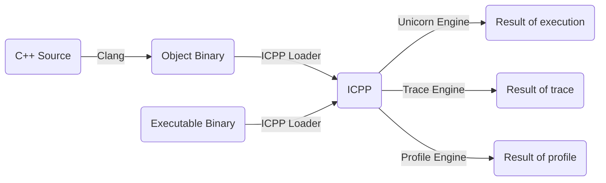

# ICPP
Interpreting C++, executing the source and executable like a script.

## Status
| OS           | C++ Source | X86_64 Binary | AArch64 Binary | X86_64 on AArch64 | AArch64 on X86_64 |
| :----------  | :--------: | :-----------: | :------------: | :---------------: | :---------------: |
| **Windows**  | &#10008;   | &#10008;      | &#10008;       | &#10008;          | &#10008;          |
| **macOS**    | &#10008;   | &#10008;      | &#10008;       | &#10008;          | &#10008;          |
| **Linux**    | &#10008;   | &#10008;      | &#10008;       | &#10008;          | &#10008;          |

## How it works


## Build
```
mkdir build
cd build
cmake -DCMAKE_BUILD_TYPE=Release ..
cmake --build . -- icpp -j8
```

## Contact
You can visit [vpand.com](https://vpand.com/) for more information on VM, VMProtect, Clang/LLVM and Reverse Engineering products. Or have any questions, just feel free to email to me:
```
neoliu2011@gmail.com
```
