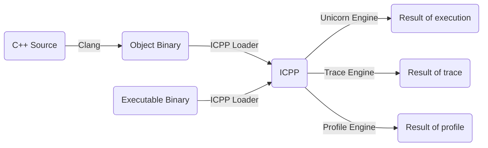

# ICPP - Running C++ like a script
Interpreting C++, executing the source and executable like a script.
 * Writing powerful script using C++ just as easy as Python;
 * Based on [Unicorn Engine](https://github.com/unicorn-engine/unicorn.git) and [Clang/LLVM](https://github.com/llvm/llvm-project.git);
 * Integrated [Boost](https://github.com/boostorg/boost.git) internally;
 * Supported C++23;
 * Make, install and reuse the existing C++ library as icpp script extension is extremely simple.

Copyright (c) vpand.com 2024.

## Scenarios
Using ICPP to write C++ code just as a script, write and then run directly, no creating project, no configuring build, no compiling, no linking...

No matter if you're a beginner or an expert with C++, ICPP is suitable for you. With ICPP, you can focus on:
 * Writing snippet code to study any of the newest C++ features;
 * Writing glue script to do some tasks;
 * Writing test code before applying to the formal project;
 * Writing sample code to study some new third C/C++ libraries;
 * Making native plugin development scriptable, i.e., writing plugin using C++ dynamically.
 * Tracing, profiling, performance optimizing;
 * And so on...

**ICPP, make programming all in one.**

## Usage

### ICPP vs Python

|Script Interpreter|Command Line|
|-|-|
|Python| % **python** helloworld.py |
|ICPP  | % **icpp** helloworld.cc |

|Module Installer|Command Line|
|-|-|
|PIP | % **pip** install helloworld.zip |
|IMOD| % **imod** helloworld.zip |

### CLI

```sh
vpand@MacBook-Pro icpp % icpp -h              
OVERVIEW: ICPP v0.0.1.255 based on Unicorn and Clang/LLVM.
  Interpreting C++, executing the source and executable like a script.

USAGE: icpp [options] file0 [file1 ...] [-- args]
OPTIONS:
  -v, -version: print icpp version.
  --version: print icpp and clang version.
  -h, -help: print icpp help list.
  --help: print icpp and clang help list.
  -O0, -O1, -O2, -O3, -Os, -Oz: optimization level passed to clang, default to -O2.
  -I/path/to/include: header include directory passed to clang.
  -L/path/to/library: library search directory passed to icpp interpreting engine.
  -lname: full name of the dependent library file passed to icpp interpreting engine, e.g.: liba.dylib, liba.so, a.dll.
  -F/path/to/framework: framework search directory passed to icpp interpreting engine.
  -fname: framework name of the dependent library file passed to icpp interpreting engine.
  -p/path/to/json: professional json configuration file for trace/profile/plugin/etc..
FILES: input file can be C++ source code(.c/.cc/.cpp/.cxx), MachO/ELF/PE executable.
ARGS: arguments passed to the main entry function of the input files.

e.g.:
  icpp helloworld.cc
  icpp helloworld.cc -- Hello World (i.e.: argc=3, argv[]={"helloworld.cc", "Hello", "World"})
  icpp -O3 helloworld.cc
  icpp -O0 -p/path/to/profile.json helloworld.cc
  icpp -p/path/to/trace.json helloworld.exe
  icpp -I/qt/include -L/qt/lib -llibQtCore.so hellowrold.cc
  icpp -I/qt/include -L/qt/lib -lQtCore.dll hellowrold.cc
  icpp -I/qt/include -F/qt/framework -fQtCore hellowrold.cc
```

## Status
Under developing...

| OS           | C++ Source | X86_64 Binary | AArch64 Binary | X86_64 on AArch64 | AArch64 on X86_64 |
| :----------  | :--------: | :-----------: | :------------: | :---------------: | :---------------: |
| **Windows**  | &#10008;   | &#10008;      | &#10008;       | &#10008;          | &#10008;          |
| **macOS**    | &#10008;   | &#10008;      | &#10008;       | &#10008;          | &#10008;          |
| **Linux**    | &#10008;   | &#10008;      | &#10008;       | &#10008;          | &#10008;          |

## How it works


## Build
Make sure the python3 command is in your system PATH environment.
```sh
mkdir build
cd build
cmake -DCMAKE_BUILD_TYPE=Release ..
cmake --build . -- icpp -j8
```

## Contact
You can visit [vpand.com](https://vpand.com/) for more information on VM, VMProtect, Clang/LLVM and Reverse Engineering products. Or if you have any questions, just feel free to email to me:
```
neoliu2011@gmail.com
```
