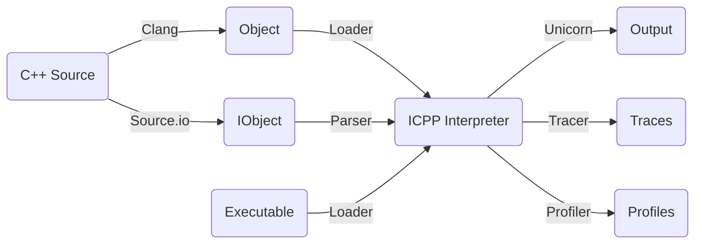
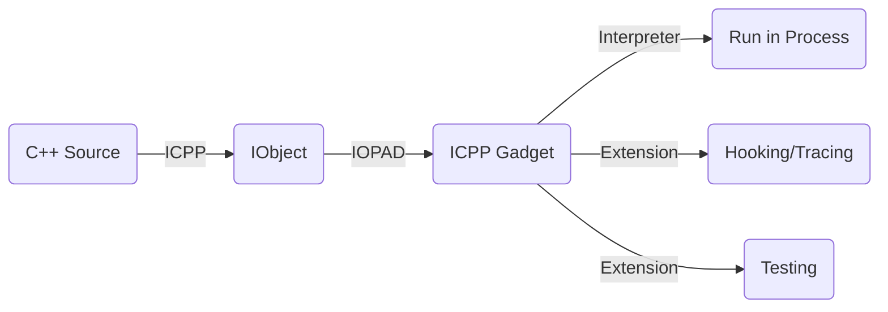

# ICPP - Running C++ in anywhere like a script
**Interpreting C++, executing the source and executable like a script.**
 * Writing powerful script using C++ just as easy as Python;
 * Writing hot-loading C++ script code in running process;
 * Based on [Unicorn Engine](https://github.com/unicorn-engine/unicorn.git) qemu virtual cpu and [Clang/LLVM](https://github.com/llvm/llvm-project.git) C++ compiler;
 * Integrated internally with [Standard C++23](https://en.cppreference.com/w/cpp/23) and [Boost](https://github.com/boostorg/boost.git) libraries;
 * To reuse the existing C/C++ library as an icpp module extension is extremely simple.

Copyright (c) vpand.com 2024.

## Comparison
|*|Source|Executable|Package|Memory Resident|Remote|
|-|-|-|-|-|-|
| **ICPP** | **C++** | **ARM64/X86_64** Object | **imod** for *.icpp | **iopad**/**icpp-gadget** | **icpp-server** |
| **LLI** | C++ | **LLVM-IR** Bitcode |  N/A | N/A | N/A | 
| **Python** | Python | Bytecode | pip for *.wheel | N/A | N/A | 
| **Frida** | JavaScript | Bytecode | N/A | frida/frida-gadget | frida-server |

## Scenarios
**Using ICPP to write C++ code just as a script.** Write and then run directly, no creating project, no configuring build, no compiling and linking...

No matter if you're a beginner or an expert with C++, ICPP is suitable for you. With ICPP, you can focus on:
 * Writing **snippet code** to study any of the newest C++ features;
 * Writing **glue script** to do some tasks;
 * Writing **test code** before applying to the formal project;
 * Writing **sample code** to study some new third C/C++ libraries;
 * Making native plugin development scriptable, i.e., **writing plugin using C++ dynamically**.
 * Tracing, profiling, performance optimizing;
 * And so on...

**ICPP, make programming all in one.**

## How it works
### Interpreter

### Hot-loading


## Usage

### Summarization
 * **icpp**: a local C++ source compiler, interpreter and REPL used to interpret C++ directly;
 * **imod**: an icpp module package manager tool used to install, uninstall and show the third-party modules;
 * **iopad**: a local C++ source compiler driver, object launch pad and REPL for the remote icpp-gadget;
 * **icpp-gadget**: a remote memory resident daemon which may run inside an Android/iOS process, waiting for iopad to send the interpretable object to execute.
 * **icpp-server**: a remote icpp-gadget server daemon, waiting for iopad to send the interpretable object to execute.

### ICPP CLI

```sh
vpand@MacBook-Pro icpp % icpp -h              
OVERVIEW: ICPP v0.1.0.255 based on Unicorn and Clang/LLVM.
  Interpreting C++, running C++ in anywhere like a script.

USAGE: icpp [options] exec0 [exec1 ...] [[--] args]
OPTIONS:
  -v, -version: print icpp version.
  --version: print icpp and clang version.
  -h, -help: print icpp help list.
  --help: print icpp and clang help list.
  -f: format the input source file as LLVM code style.
  -O0, -O1, -O2, -O3, -Os, -Oz: optimization level passed to clang, default to -O2.
  -I/path/to/include: header include directory passed to clang.
  -L/path/to/library: library search directory passed to icpp interpreter.
  -lname: full name of the dependent library file passed to icpp interpreter, e.g.: liba.dylib, liba.so, a.dll.
  -F/path/to/framework: framework search directory passed to icpp interpreter.
  -fname: framework name of the dependent library file passed to icpp interpreter.
  -p/path/to/json: professional json configuration file for trace/profile/plugin/etc..
FILES: input file can be C++ source code(.c/.cc/.cpp/.cxx), MachO/ELF/PE executable.
ARGS: arguments passed to the main entry function of the input files.

Run a C++ source file, e.g.:
  icpp helloworld.cc
  icpp helloworld.cc -- Hello World (i.e.: argc=3, argv[]={"helloworld.cc", "Hello", "World"})
  icpp -O3 helloworld.cc
  icpp -O0 -p/path/to/profile.json helloworld.cc
  icpp -I/qt/include -L/qt/lib -llibQtCore.so hellowrold.cc
  icpp -I/qt/include -L/qt/lib -lQtCore.dll hellowrold.cc
  icpp -I/qt/include -F/qt/framework -fQtCore hellowrold.cc

Run an executable, e.g.:
  icpp -p/path/to/trace.json helloworld.exe
  icpp -p/path/to/profile.json helloworld

Run an installed module, e.g.:
  icpp helloworld
  icpp helloworld -- hello world

Run an C++ expression, e.g:
  icpp "puts(std::format(\"{:x}\", 88888888).data())"
```
### ICPP REPL
```sh
vpand@MacBook-Pro icpp % icpp     
ICPP v0.1.0.255. Copyright (c) vpand.com.
Running C++ in anywhere like a script.
>>> #include <stdio.h>
>>> puts("Hello, world.")   
Hello, world.
>>> import std 
>>> std::cout << "Hello, world." << std::endl
Hello, world.
>>> std::cout << std::hex << 88888888 << std::endl
54c5638
```
### IMOD
```sh
vpand@MacBook-Pro icpp % imod -h                
OVERVIEW: ICPP, Interpreting C++, running C++ in anywhere like a script.
  IObject Module Manager Tool built with ICPP v0.1.0.255
USAGE: imod [options]

OPTIONS:

ICPP Module Manager Options:

  --create=<string>    - Create an icpp package from a json configuration file.
  --install=<string>   - Install an icpp package file.
  --list               - List all the installed modules.
  --uninstall=<string> - Uninstall an installed module.
```
### IOPAD
```sh
vpand@MacBook-Pro icpp % iopad -h
OVERVIEW: ICPP, Interpreting C++, running C++ in anywhere like a script.
  IObject Launch Pad Tool built with ICPP v0.1.0.255
USAGE: iopad [options]

OPTIONS:

ICPP Interpretable Object Launch Pad Options:

  --fire=<string>   - Fire the input source file to the connected remote icpp-gadget to execute it.
  --incdir=<string> - Specify the include directory for compilation, can be multiple.
  --ip=<string>     - Set the remote ip address of icpp-gadget.
  --ndk=<string>    - Set the Android NDK root path, default to the parent directory of the ndk-build in PATH.
  --port=<int>      - Set the connection port.
  --repl            - Enter into a REPL interactive shell to fire the input snippet code to the connected remote icpp-gadget to execute it.
```
### ICPP-SERVER
```sh
vpand@MacBook-Pro icpp % icpp-server -h
OVERVIEW: ICPP, Interpreting C++, running C++ in anywhere like a script.
  Remote icpp-gadget server built with ICPP v0.1.0.255
USAGE: icpp-server [options]

OPTIONS:

ICPP Remote Gadget Server Options:

  --port=<int> - Set the listening port.
```

## Status
### Implementation
| OS           | C/C++ Source | Executable Binary | X86_64 on AArch64 | AArch64 on X86_64 |
| :----------  | :--------:   | :------------: | :---------------: | :---------------: |
| **Windows**  | &#10004;     | &#10008;       | &#10008;          | &#10008;          |
| **macOS**    | &#10004;     | &#10008;       | &#10008;          | &#10008;          |
| **Linux**    | &#10004;     | &#10008;       | &#10008;          | &#10008;          |
| **Android**    | &#10004;     | &#10008;       | &#10008;          | &#10008;          |
| **iOS**    | &#10004;     | &#10008;       | &#10008;          | &#10008;          |
### Platform
 * Microsoft: Windows x86_64 >= **10**, Windows arm64 >= **11**;
 * Apple: macOS x86_64 >= **10.15**, macOS arm64 >= **11.3**;
 * iOS: iOS arm64 >= **10.0**;
 * Linux: **Ubuntu** x86_64/aarch64 >= **22.04**;
 * Android: Android x86_64/arm64-v8a >= **platform 25**; 

## Build
To build your own version of icpp, make sure all of the **prerequisites** are in your system PATH environment:
 * **CMake** (version >= 3.20);
 * **Python** (Windows), Python3 (macOS/Linux);
 * **Ninja** (Windows), **Make** (macOS/Linux);
 * Visual Studio with **LLVM Toolchain** (Windows);

### Clone
```sh
# clone icpp
git clone --depth=1 https://github.com/vpand/icpp.git
cd icpp
# clone llvm, unicorn engine, boost, etc.
git submodule update --init --recursive --depth=1
mkdir build
cd build
```

### CMake
#### Windows X86_64
```sh
# NOTE:
# all the following steps must be done in "x64 Native Tools Command Prompt for VS"
# or
# run VS_ROOT/.../VC/Auxiliary/Build/vcvarsall.bat to initialize for 'x64'
vcvarsall x64
# we use clang-cl as our compiler, to make it working, you should:
# have installed the Visual Studio with LLVM Toolchain support.
cmake -G Ninja -DCMAKE_C_COMPILER=clang-cl -DCMAKE_CXX_COMPILER=clang-cl -DCMAKE_BUILD_TYPE=Release ..
```

#### Windows ARM64
```sh
# NOTE:
# all the following steps must be done in "ARM64 Native Tools Command Prompt for VS"
# or
# run VS_ROOT/.../VC/Auxiliary/Build/vcvarsall.bat to initialize for 'arm64'
vcvarsall arm64
# we use clang-cl as our compiler, to make it working, you should:
# have installed the Visual Studio with LLVM Toolchain support.
#
# Because of the cmake script of boost and unicorn has kind of hardcode snippet for 
# some paths, like the path of lib.exe, assembler search directory, so we have some 
# extra steps to make this cmake command working:
# 1.copy llvm-lib.exe as lib.exe in LLVM_ROOT/bin;
# 2.copy VC_ROOT/bin/armasm64.exe to LLVM_ROOT/bin/armasm64.exe.exe;
# 3.build cmake/boost/armasm64 and copy it to LLVM_ROOT/bin/armasm64.exe;
#
cmake -G Ninja -DCMAKE_C_COMPILER=clang-cl -DCMAKE_CXX_COMPILER=clang-cl -DCMAKE_MT=llvm-mt -DCMAKE_ASM_MASM_COMPILE_OBJECT=armasm64 -DCMAKE_BUILD_TYPE=Release ..
```

#### Linux AArch64/X86_64
```sh
# create the clang to be customized building scripts
cmake -B clangconf -DCMAKE_BUILD_TYPE=Release ../cmake/clangconf
# build our clang compiler with itself's libc++ support
cmake --build clangconf -- clang runtimes -j8
# use the clang that we built before as our compiler
cmake -DCMAKE_C_COMPILER=$PWD/llvm/bin/clang -DCMAKE_CXX_COMPILER=$PWD/llvm/bin/clang -DCMAKE_BUILD_TYPE=Release ..
```

#### macOS ARM64/X86_64
```sh
# if your system default clang doesn't support C++20 before the version of macOS 11,
# you should compile your own clang and apply it like on Linux
cmake -DCMAKE_BUILD_TYPE=Release ..
```

### Make
```sh
# build the protoc compiler
cmake --build . -- protoc -j8
# build all the icpp components
cmake --build . -- icpp icppcli imod iopad icpp-gadget icpp-server -j8
```

## Contact
You can visit [vpand.com](https://vpand.com/) for more information on **VM, VMProtect, Clang/LLVM and Reverse Engineering** products.

Or if you have any questions, just feel free to email to me:
```
neoliu2011@gmail.com
```
