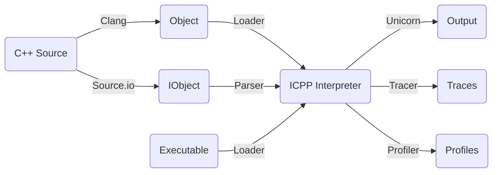
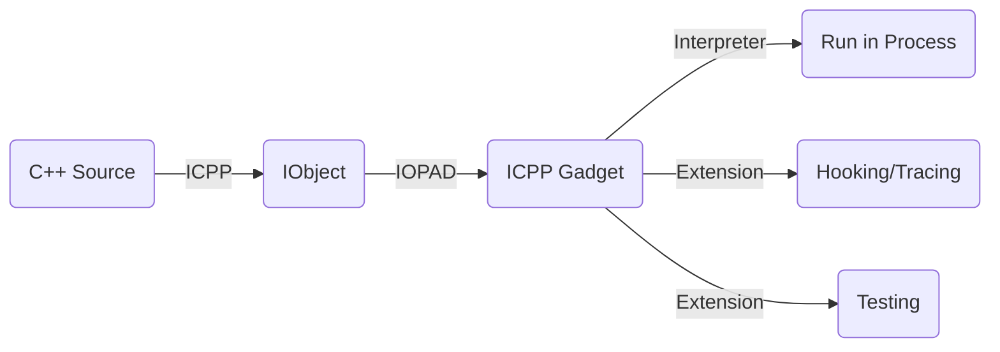

## What is ICPP
ICPP(acronym for Interpreted C++) is a C++ interpreter. You can run C++ code with icpp directly in a local or remote system and the local icpp-in-process or remote process, without any manual compiling and linking configuration. It makes C++ behaving like a script language.

**Interpreting C++, executing the source and executable like a script.**
 * Writing powerful script using C++ just as easy as Python;
 * Writing hot-loading C++ script code in running process;
 * Based on [Unicorn Engine](https://github.com/unicorn-engine/unicorn.git) qemu virtual cpu and [Clang/LLVM](https://github.com/llvm/llvm-project.git) C++ compiler;
 * Integrated internally with [Standard C++23](https://en.cppreference.com/w/cpp/23) and [Boost](https://github.com/boostorg/boost.git) libraries;
 * To reuse the existing C/C++ library as an icpp module extension is extremely simple.

## How it works
The main mechanism of icpp is compiling the input C++ source to a temporary binary object file, and then interpreting this object file using an interpreter based on a virtual cpu named unicorn which is modified from qemu. The vm-like interpreter of icpp processes the instruction emulation, instruction relocation and register context switching with the native runtime environment.

If you use the old C style #include directive instead of the new C++ module style import directive, compiling the source may cost a lot of time. Consequently, to improve performance, icpp will generate a cache file(extension name is .io) if it succeeds running a C++ source file. The .io file includes compiled object binary file and encoded interpreter vm instructions which make the next executing much faster.
### Interpreter
Local interpreter mode lets you run C++ directly in your local system.

### Hot-loading
Remote interpreter mode lets you run C++ remotely in a different process or system which loads the icpp-gadget library. This mode allows you to run C++ code dynamically in a running local process or a remote system like Android/iOS.

## Comparison
### ICPP vs Others
|*|Source|Executable|Package|Memory Resident|Remote|
|-|-|-|-|-|-|
| **ICPP** | **C++** | **ARM64/X86_64** Object | **imod** for *.icpp | **iopad**/**icpp-gadget** | **icpp-server** |
| **Cling** | C++ | **LLVM-IR** Bitcode |  N/A | N/A | N/A | 
| **LLI** | C++ | **LLVM-IR** Bitcode |  N/A | N/A | N/A | 
| **WASM** | C++ | **WebAssembly** Bitcode |  N/A | N/A | N/A | 
| **Python** | Python | Bytecode | pip for *.wheel | N/A | N/A | 
| **Frida** | JavaScript | Bytecode | N/A | frida/frida-gadget | frida-server |

### ICPP vs Cling
According to its project documentation, cling and icpp are at least very different in the following items:
1. cling uses JIT just like the llvm-project/LLI, icpp uses self defined vm interpreter depends on unicorn/qemu, so cling's performance is better than icpp;
2. cling works only in local process/system, icpp works both local and remote process/system, i.e., icpp's interpreter can run in anywhere like Android/iOS with the icpp-server/icpp-gadget tools, so icpp's cross process/platform operation ability is better than cling;
3. cling is a pure C++ interpreter, icpp is a C++ interpreter and even a reverse engineering platform, plugin extension platform, etc.;
4. maybe more...

### ICPP vs Wasm
The runtime of ICPP is absolutely the same as native, so it can be integrated to any native environment directly. Running C++ in icpp is the same as running it in native environment and they just have performance differences, the other behaviours are 100% the same.

But a wasm-like C++ interpreter has a middle layer which may be called webassembly bytecode, so it's just like a Python interpreter, the difference between them is the language, one is C++, one is python. If you want to interact with the native api, you probably should need a wasm and native bridge layer.

So, icpp and wasm based interpreter are very different things.

## User manual
You can visit [DOC](https://github.com/vpand/icpp/tree/main/doc) for more user manuals.
