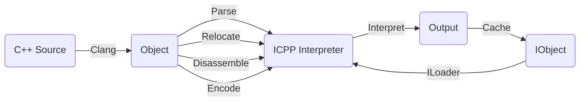

# User Manual of icpp
## Summarization
ICPP is a local C++ source compiler, a LLVM code style formatter, an interpreter and a REPL used to interpret C++ directly.

## How it works
Firstly, it compiles the input C++ source to a temporary macho, elf or pe object file, the exact type depends on your local system or the icpp-gadget running environment.

Secondly, it loads this object file into memory and does the following tasks:
 * 1.Parse the symbols, relocations and sections of this object file;
 * 2.Relocate data sections and allocate dynamic bss sections memory;
 * 3.Disassemble the text section and encode all the instructions into icpp interpreter's vm instruction metadata.

Thirdly, it enters into icpp's interpreter execution loop, interpreting relocated instructions one by one or emulating an instruction block using the unicorn engine until finishing the logic of this object file's main function.

Lastly, if everything of this execution goes well, it generates a .io cache file which includes the compiled object file, all the encoded instructions, and referenced runtime modules. This kind of cache file makes the next time running much faster.


## Usage
```sh
vpand@MacBook-Pro icpp % icpp -h              
OVERVIEW: ICPP v0.1.0.255 based on Unicorn and Clang/LLVM.
  Interpreting C++, running C++ in anywhere like a script.

USAGE: icpp [options] exec0 [exec1 ...] [[--] args]
OPTIONS:
  -v, -version: print icpp version.
  --version: print icpp and clang version.
  -h, -help: print icpp help list.
  --help: print icpp and clang help list.
  -f: format the input source file as LLVM code style.
  -O0, -O1, -O2, -O3, -Os, -Oz: optimization level passed to clang, default to -O2.
  -I/path/to/include: header include directory passed to clang.
  -L/path/to/library: library search directory passed to icpp interpreter.
  -lname: full name of the dependent library file passed to icpp interpreter, e.g.: liba.dylib, liba.so, a.dll.
  -F/path/to/framework: framework search directory passed to icpp interpreter.
  -fname: framework name of the dependent library file passed to icpp interpreter.
  -p/path/to/json: professional json configuration file for trace/profile/plugin/etc..
FILES: input file can be C++ source code(.c/.cc/.cpp/.cxx), MachO/ELF/PE executable.
ARGS: arguments passed to the main entry function of the input files.

Run a C++ source file, e.g.:
  icpp helloworld.cc
  icpp helloworld.cc -- Hello World (i.e.: argc=3, argv[]={"helloworld.cc", "Hello", "World"})
  icpp -O3 helloworld.cc
  icpp -O0 -p/path/to/profile.json helloworld.cc
  icpp -I/qt/include -L/qt/lib -llibQtCore.so hellowrold.cc
  icpp -I/qt/include -L/qt/lib -lQtCore.dll hellowrold.cc
  icpp -I/qt/include -F/qt/framework -fQtCore hellowrold.cc

Run an executable, e.g.:
  icpp -p/path/to/trace.json helloworld.exe
  icpp -p/path/to/profile.json helloworld

Run an installed module, e.g.:
  icpp helloworld
  icpp helloworld -- hello world

Run an C++ expression, e.g:
  icpp "puts(std::format(\"{:x}\", 88888888).data())"
```

## Interpreter
This interpreter accepts various kind of input via command line arguments, including:
 * C++ expression;
 * C++ source file;
 * The icpp module installed by imod;
 * IObject file(i.e.: Interpretable Object, an icpp's cache file) ;
 * Executable binary file(Unimplemented currently);

The general command line format is as follows:
```sh
icpp [icpp-args] file0 file1 [...] [[--] script-args]
```
 * icpp-args: these arguments are passed to the icpp command line driver;
 * fileN: these arguments are the input file to be executed by the icpp interpreter;
 * --: it's an optional separator flag, indicating where the script argument starts. It's useful when ambiguity occurs when icpp parsing arguments;
 * script-args: these arguments are passed to the executing script main(argc, argv) function;

The execution flow of this input file is in the following sequence:
 * 1.File level constructors, like C++ global class instance ctor functions;
 * 2.The general C program main(argc, argv) entry, will skip this step if there's no one;
 * 3.File level destructors, but they usually will be called by __cxa_atexit which is automatically generated by clang.

### Usage
 * -v, -h: print icpp's version and help information;
 * -Oopt_level, -Iinclude_dir: pass it to the clang compiler when compiling the temporary object file;
 * -Llibrary_dir, -Fframwork_dir, -llib, -fframework: pass it to the icpp interpreter to load the script's dependent library or framework;
 * -pjson_file: pass it to the icpp interpreter runtime configuration, it's only useful for the icpp developer currently;

### Examples
 * C++ expression, this mode has already included <icpp.hpp>, so you just need to input the exact C++ expression without any extra directives.
```cpp
vpand@MacBook-Pro icpp % icpp "std::puts(\"Hello icpp.\")"
Hello icpp.

vpand@MacBook-Pro icpp % icpp "auto i=88888888; std::printf(\"Hex of %d is 0x%x.\", i, i)"
Hex of 88888888 is 0x54c5638.

vpand@MacBook-Pro icpp % icpp "std::cout << \"Hello world.\" << std::endl"              
Hello world.
```

 * C++ source file
```sh
vpand@MacBook-Pro icpp icpp % icpp snippet/printargv.cc 
argc=1, argv={ "snippet/printargv.cc", }

vpand@MacBook-Pro icpp icpp % icpp snippet/printargv.cc Hello world .
argc=4, argv={ "snippet/printargv.cc", "Hello", "world", ".", }

vpand@MacBook-Pro icpp icpp % icpp snippet/printargv.cc -- Hello world .
argc=4, argv={ "snippet/printargv.cc", "Hello", "world", ".", }
```

## REPL
This read–eval–print loop (REPL) is a simple interactive C++ programming environment that takes single user inputs, executes them, and returns the result to the user. The different input C++ snippets in the REPL environment are executed piecewise, i.e. each time they are executed in a different interpreter context, so they cannot share any data automatically unless you use the icpp api.

### Usage
If you specify nothing on command line when executing icpp, it'll enter REPL shell. Because each execution will do a compilation task, in order to get a fast compiling, we strongly recommend you use the C++ module import syntax which has been integrated in the icpp package to include the std definitions.

### Examples
Here's a simple demonstration.
```cpp
vpand@MacBook-Pro icpp % icpp
ICPP v0.1.0.255. Copyright (c) vpand.com.
Running C++ in anywhere like a script.
>>> import std
>>> std::puts("Hello icpp.")
Hello icpp.
>>> auto i=88888888; std::printf("Hex of %d is 0x%x.\n",i,i)
Hex of 88888888 is 0x54c5638.
>>> std::cout << "Hello world." << std::endl
Hello world.
```

## Compiler
The compiler integrated in icpp is clang, so you can use the icpp command line tool as a clang compiler which will apply some default icpp related flags to simplify your input arguments.

### Usage
In general, you only need the following arguments to compile a local system compatible object file:
```sh
icpp -c source.cc -o object.o
```
If you want to build an iOS or Android object file, some extra flags should be supplied:
 * iOS: -target arm64-apple-ios10.0;
 * Android: -target aarch64-none-linux-android24 --sysroot /path/to/ndk/sysroot;

### Examples
```sh
vpand@MacBook-Pro icpp % icpp -c helloworld.cc -o helloworld.o
vpand@MacBook-Pro icpp % icpp -target arm64-apple-ios12.0 -c helloworld.cc -o helloworld.o
```

## Formatter
The code formatter integrated in icpp is clang-format, so you can use the icpp command line as a code formatter tool which will apply some default formatting flags to simplify your input arguments.

### Usage
 * -f: format the input file to the LLVM code style, it's a simple wrapper of clang-format -i -style=LLVM;

### Examples
```sh
vpand@MacBook-Pro icpp % icpp -f helloworld.cc
vpand@MacBook-Pro icpp % icpp -f helloicpp.cc helloworld.cc
```
